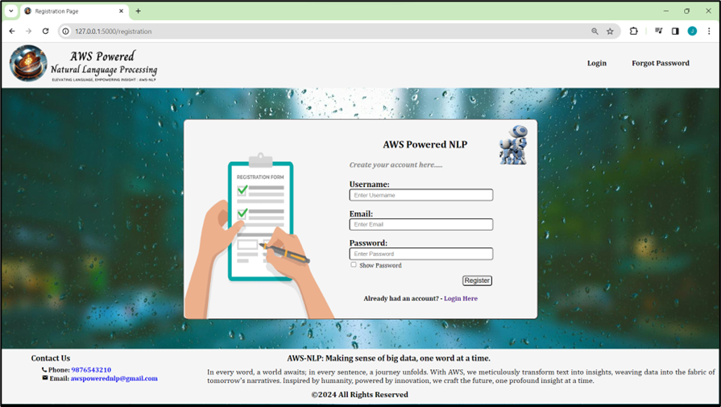
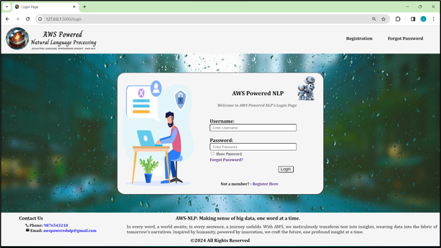

# AWS-Powered Natural Language Processing

## Table of Contents

- [Introduction](#introduction)
- [Features](#features)
- [Technologies Used](#technologies-used)
- [System Requirements](#system-requirements)
  - [Software Requirements](#software-requirements)
  - [Hardware Requirements](#hardware-requirements)
- [Project Architecture](#project-architecture)
- [Modules](#modules)
- [Testing](#testing)
- [Results](#results)
- [Future Scope](#future-scope)
- [References](#references)

## Introduction

Natural Language Processing (NLP) has revolutionized how we interact with machines by enabling them to understand and interpret human language. With the rapid digital transformation across industries, NLP applications play a crucial role in automating tasks, analyzing data, and deriving insights from textual and multimedia sources.

The **AWS-Powered Natural Language Processing** project is a sophisticated web-based application designed to offer a comprehensive suite of NLP tools. Leveraging the powerful capabilities of Amazon Web Services (AWS) and third-party APIs, this application provides users with functionalities such as sentiment analysis, speech-to-text conversion, image text extraction, and a conversational chatbot interface.

## Features

- **Sentiment Analysis**: Analyze the emotional tone of textual data using Amazon Comprehend.
- **Speech-to-Text Conversion**: Convert speech audio files into text with Amazon Transcribe.
- **Image Text Extraction**: Extract text from images using Amazon Textract.
- **Chatbot Interface**: Engage in conversations with an interactive chatbot powered by OpenAI's GPT-3.5.
- **User Authentication**: Secure user registration, login, and password management.
- **History Tracking**: Store and access previous interactions and analyses.
  
## Technologies Used

The project integrates various technologies to provide a robust and scalable NLP solution:

- **Programming Languages**:
  - Python: Primary language for backend development and scripting.
  - HTML/CSS/JavaScript: For frontend development.

- **Web Framework**:
  - Flask: Lightweight Python web framework for handling HTTP requests and routing.

- **Database Management**:
  - MySQL: Relational database for storing user data, sentiment analysis results, and chatbot interactions.

- **Cloud Services**:
  - Amazon Web Services (AWS): Utilized for deploying the NLP application.
    - **Amazon Comprehend**: For sentiment analysis.
    - **Amazon Transcribe**: For speech-to-text conversion.
    - **Amazon Textract**: For image text extraction.

- **NLP Libraries and APIs**:
  - Boto3: Python SDK for AWS, enabling interaction with AWS services.
  - OpenAI API: Provides access to the GPT-3.5 model for enhancing NLP capabilities.

- **Development Tools**:
  - IDEs: PyCharm, Visual Studio Code for writing and debugging code.
  - Version Control: Git for managing code changes and collaboration.

- **Testing Frameworks**:
  - Pytest: Python testing framework for unit testing.

## System Requirements

### Software Requirements

- **Python**: Version 3.7 or above.
- **Flask**: Version 1.1 or above.
- **MySQL**: Version 8.0 or above.
- **AWS SDK for Python (Boto3)**: Latest version.
- **OpenAI API**: Access to GPT-3.5.
- **HTML/CSS/JavaScript**: For frontend interfaces.
- **Git**: For version control.

### Hardware Requirements

- **RAM**: 16GB or more.
- **Storage**: Minimum 500GB SSD.
- **Internet Adapter**: 1Gbps or faster.

## Project Architecture

The architecture of the AWS-Powered NLP application is designed to ensure scalability, efficiency, and ease of deployment. The following diagram provides a high-level overview of the system architecture:

```plaintext
                          +-------------------+
                          |    User Interface |
                          +-------------------+
                                   |
                                   v
                          +-------------------+
                          |   Flask Backend   |
                          +-------------------+
                                   |
       +---------------------------+-----------------------------+
       |                           |                             |
       v                           v                             v
+--------------+         +-------------------+         +--------------------+
| User Module  |         |  NLP Processing   |         | AWS Integration    |
+--------------+         +-------------------+         +--------------------+
       |                           |                             |
       v                           v                             v
+--------------+         +-------------------+         +--------------------+
| Authentication|        | Sentiment Analysis|         | Amazon Comprehend  |
+--------------+         +-------------------+         +--------------------+
       |                           |                             |                 
       |                           v                             |
       |                  +-------------------+                  |
       +------------- >   |   MySQL Database  |  < --------------+
                          +-------------------+
```

## Modules

### 1. User Authentication Module

- Implements user registration, login, and password reset functionality.
- Utilizes token-based authentication for secure access.
- Integrates with MySQL to store user credentials and session tokens.

### 2. Sentiment Analysis Module

- Leverages AWS Comprehend to analyze text sentiment (positive, negative, neutral).
- Accepts text input from users and stores results in the MySQL database.

### 3. Speech-to-Text Conversion Module

- Utilizes AWS Transcribe to convert speech audio files into text.
- Handles user-uploaded audio files and retrieves text transcripts.
- Stores transcripts and metadata in the MySQL database.

### 4. Image Text Extraction Module

- Uses AWS Textract to extract text from images.
- Processes uploaded images and retrieves extracted text.
- Stores text and metadata in the MySQL database.

### 5. Chatbot Interface Module

- Integrates OpenAI's GPT-3.5 for conversational interactions.
- Allows users to engage with the chatbot for assistance and information.
- Stores interactions in the MySQL database.

### 6. Frontend Development Module

- Implements user interfaces using HTML, CSS, and JavaScript.
- Provides a seamless and user-friendly experience.

## Testing

Comprehensive testing ensures the reliability and functionality of the AWS-Powered NLP application. The testing process includes both unit and integration testing to verify individual components and their interactions. Here are some key test cases:

| Test Case Description                                   | Expected Outcome                       | Status      |
|---------------------------------------------------------|----------------------------------------|-------------|
| User registration with valid credentials                | User account created successfully      | Successful  |
| User login with correct username and password           | User logged in successfully            | Successful  |
| Sentiment analysis for a positive text                  | Returns a positive sentiment result    | Successful  |
| Speech-to-text conversion for a clear audio file        | Correct text transcript generated      | Successful  |
| Image text extraction for a high-resolution image       | Accurate text extracted                | Successful  |
| Chatbot response to a general knowledge question        | Provides a correct response            | Successful  |
| Error handling for invalid user inputs                  | Displays proper error messages         | Successful  |

## Results

The AWS-Powered NLP application has been successfully developed and deployed, offering a wide range of functionalities to users. Below are some screenshots illustrating the application's user interface:

### 1. Title Page


### 2. Registration Page


### 3. Login Page


### 4. Forgot Password Page


### 5. Home Page


### 66. Sentiment Analysis Page


### 7. Speech-to-Text Page


### 8. Text-to-Speech Page


### 9. Image Text Extraction Page


### 10. Chatbot Page


### 11. History Page


### 12. AboutUs Page


## Future Scope

The AWS-Powered NLP project lays a strong foundation for further advancements in natural language processing applications. Potential future developments include:

1. **Enhanced Multilingual Support**: Expanding support for additional languages to cater to a global audience.
2. **Real-time Processing**: Implementing real-time analysis capabilities for streaming data and live interactions.
3. **Advanced Emotion Detection**: Enhancing sentiment analysis to detect complex emotions and sentiments.
4. **Integration with IoT Devices**: Extending the application's capabilities to interact with Internet of Things (IoT) devices for seamless data exchange.
5. **Customization Options**: Allowing users to customize NLP models for specific domains or use cases.

## References

- [Amazon Comprehend](https://aws.amazon.com/comprehend/)
- [Amazon Transcribe](https://aws.amazon.com/transcribe/)
- [Amazon Textract](https://aws.amazon.com/textract/)
- [OpenAI API](https://openai.com/api/)
- [Flask Documentation](https://flask.palletsprojects.com/)
- [MySQL Documentation](https://dev.mysql.com/doc/)
- [Boto3 Documentation](https://boto3.amazonaws.com/v1/documentation/api/latest/index.html)

For complete source code, visit the [GitHub repository](https://github.com/Jameers23/aws-nlp).

## Contact

For any queries, feel free to reach out to me at [jameers2003@gmail.com](mailto:jameers2003@gmail.com).
